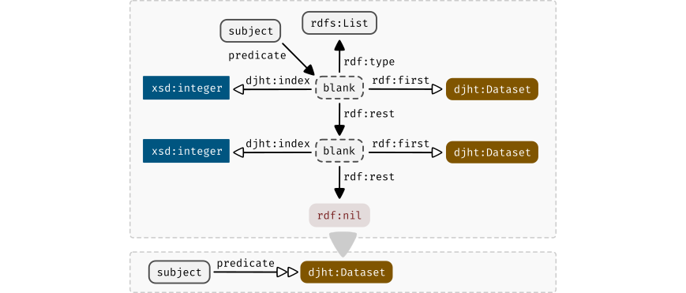
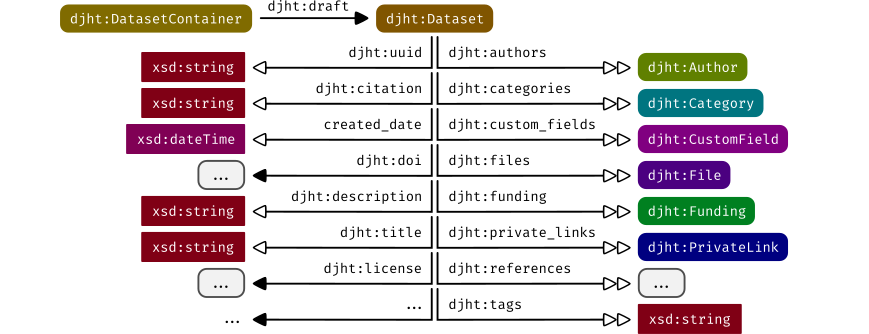
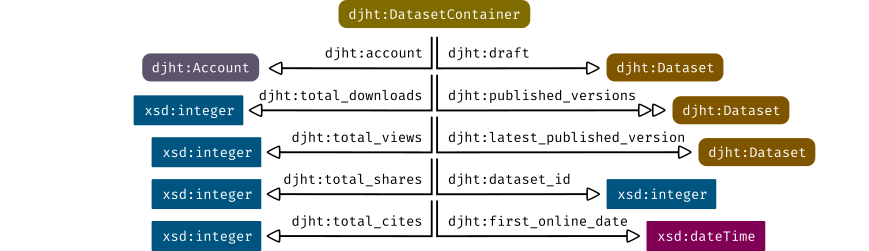
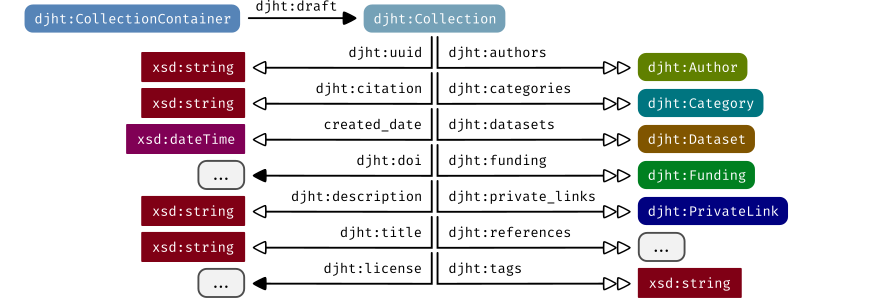
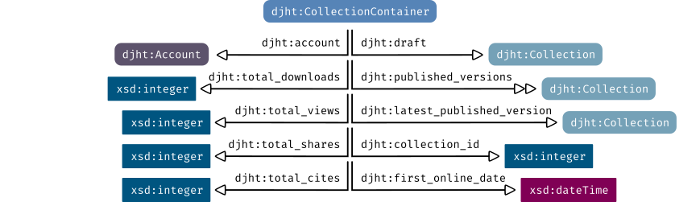
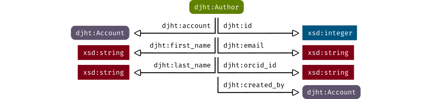
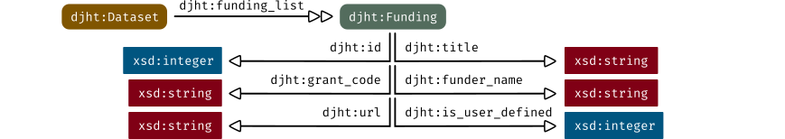
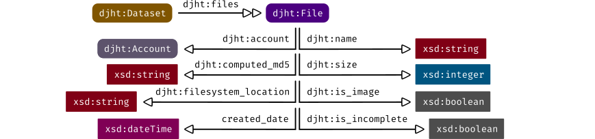
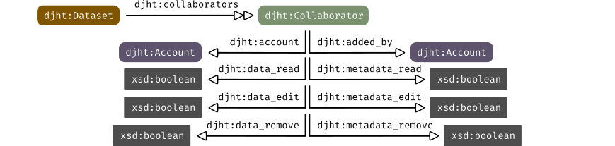

# Knowledge graph

`djehuty` processes its information using the [Resource Description Framework](https://www.w3.org/TR/1999/REC-rdf-syntax-19990222/).
This chapter describes the parts that make up the data model of `djehuty`.

This chapter dives into the structure of the data model, but does not describe
every property. When running an instance of `djehuty`, the "Exploratory"
available in the "Admin panel" can be used to explore every property.

## Use of vocabularies

Throughout this chapter, abbreviated references to ontologies are used. The
table below lists these abbreviations.

| Abbreviation | Ontology URI |
|---|---|
| `djht` | Internal and unpublished ontology. |
| `rdf` | http://www.w3.org/1999/02/22-rdf-syntax-ns# |
| `rdfs` | http://www.w3.org/2000/01/rdf-schema# |
| `xsd` | http://www.w3.org/2001/XMLSchema# |

## Notational shortcuts

In addition to abbreviating ontologies with their prefix we use another
notational shortcut. To effectively communicate the structure of the RDF graph
used by `djehuty` we introduce a couple of shorthand notations.

### Notation for typed triples

When the `object` in a triple is *typed*, we introduce the shorthand to only
show the type, rather than the actual value of the `object`. The figures below
display this for URIs and for literals respectively.

*Figure: Shorthand notation for triples with an `rdf:type`, which features a hollow predicate arrow and a colored type specifier with rounded corners.*

Literals are depicted by rectangles (with sharp edges) in contrast to URIs
which are depicted as rectangles with rounded edges.

*Figure: Shorthand notation for triples with a literal, which features a hollow predicate arrow and a colored rectangular type specifier.*

When the subject of a triple is the shorthand type, assume the subject is not
the type itself but the subject which has that type.

### Notation for `rdf:List`

To preserve the order in which lists were formed, the data model makes use of
`rdf:List` with numeric indexes. This pattern will be abbreviated in the
remainder of the figures as displayed below.

*Figure: Shorthand notation for `rdf:List` with numeric indexes, which features a hollow double-arrow. Lists have arbitrary lengths, and the numeric indexes use 1-based indexing.*

The hollow double-arrow depicts the use of an `rdf:List` with numeric indexes.

## Datasets

Datasets play a central role in the repository system because every other type
links in one way or another to it. The user submits files along with data about
those bytes as a single record which we call a `djht:Dataset`. The figure below
shows how the remainder of types in this chapter relate to a `djht:Dataset`.

*Figure: The RDF pattern for a `djht:Dataset`. For a full overview of `djht:Dataset` properties, use the exploratory from the administration panel.*

Datasets are versioned records. The data and metadata between versions can
differ, except all versions of a dataset share an identifier. We use
`djht:DatasetContainer` to describe the version-unspecific properties of a set
of versioned datasets.

*Figure: The RDF pattern for a `djht:DatasetContainer`. All versions of a dataset share a `djht:dataset_id` and a UUID in the container URI.*

The data model follows a natural expression of published versions as a linked
list. The figure above further reveals that the *view*, *download*, *share* and
*citation* counts are stored in a version-unspecific way.

## Collections

Collections provide a way to group `djht:Dataset` objects.

*Figure: The RDF pattern for a `djht:Collection`. For a full overview of `djht:Collection` properties, use the exploratory from the administration panel.*

Collections are (just like Datasets) versioned records. The metadata between
versions can differ, except all versions of a collection share an identifier.
We use `djht:CollectionContainer` to describe the version-unspecific properties
of a set of versioned collections.

*Figure: The RDF pattern for a `djht:CollectionContainer`. All versions of a collection share a `djht:collection_id` and a UUID in the container URI.*

The data model follows a natural expression of published versions as a linked
list. The figure above further reveals that the *view*, *download*, *share* and
*citation* counts are stored in a version-unspecific way.

## Authors

`djehuty` keeps records of authors including their full name, ORCID, and e-mail
address. Furthermore, each `djht:Account` has a linked `djht:Author` record.

*Figure: The RDF pattern for a `djht:Author`.*

## Accounts

`djehuty` uses an external identity provider, but stores an e-mail address,
full name, and preferences for categories.

*Figure: The RDF pattern for a `djht:Account`.*

## Funding

When the `djht:Dataset` originated out of a funded project, the funders can be
listed using `djht:Funding`. The figure below displays the details for this
structure.

*Figure: The RDF pattern for a `djht:Funding`.*

## Categories

Categories in `djehuty` are a controlled vocabulary based on the
[Australian and New Zealand Standard Research Classification (ANZSRC)](https://www.abs.gov.au/Ausstats/abs@.nsf/Latestproducts/4AE1B46AE2048A28CA25741800044242).
The hierarchical structure is captured by using `id` and `parent_id` properties.

*Figure: The RDF pattern for a `djht:Category`.*

## Institutions/groups

A `djht:Account` has an affiliation with an institute or research group. The
`djht:InstitutionGroup` is stored per `djht:Dataset` and `djht:Collection`. The
groups can be structured hierarchically by using the `id` and `parent_id`
properties.

*Figure: The RDF pattern for a `djht:InstitutionGroup`.*

## Files

A `djht:Dataset` keeps a list of `djht:File` records. The file metadata is
stored in the knowledge graph while the file contents are stored on a
filesystem. The location of the file data is tracked via the
`djht:filesystem_location` property.

*Figure: The RDF pattern for a `djht:File`.*

## Private links

Before a `djht:Dataset` or a `djht:Collection` is made publicly available, it
can be shared using a private link. The figure below displays how private links
are stored for a `djht:Dataset`, and it works the same for a
`djht:Collection`.

*Figure: The RDF pattern for a `djht:PrivateLink`.*

## Collaborators

To enable multiple accounts collaborating on a dataset before it's published,
each `djht:Dataset` can have a list of `djht:Collaborator` objects. A
`djht:Collaborator` can be given read, edit, and/or remove rights independently
for both metadata (the form fields) and data (the files).

*Figure: The RDF pattern for a `djht:Collaborator`.*
