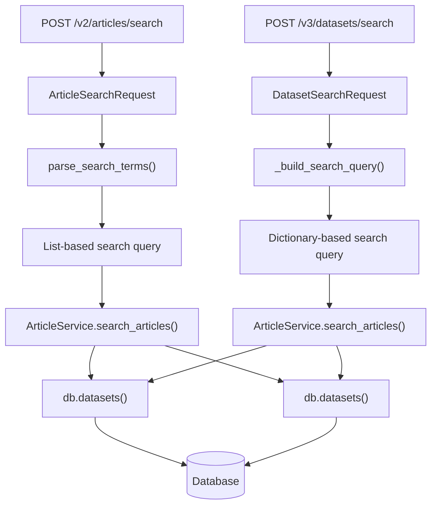

# Article/Dataset search API - v2 and v3 request flow:

```mermaid
flowchart TD
    V2API["POST /v2/articles/search"]
    V2MODEL["ArticleSearchRequest"]
    V2PARSE["parse_search_terms()"]
    V2SHAPE["List-based search query"]
    V2SERVICE["ArticleService.search_articles()"]

    V3API["POST /v3/datasets/search"]
    V3MODEL["DatasetSearchRequest"]
    V3PARSE["_build_search_query()"]
    V3SHAPE["Dictionary-based search query"]
    V3SERVICE["ArticleService.search_articles()"]

    ROWS[" db.datasets()"]
    COUNT[" db.datasets()"]
    DB[("Database")]

    V2API --> V2MODEL
    V2MODEL --> V2PARSE
    V2PARSE --> V2SHAPE
    V2SHAPE --> V2SERVICE

    V3API --> V3MODEL
    V3MODEL --> V3PARSE
    V3PARSE --> V3SHAPE
    V3SHAPE --> V3SERVICE

    V2SERVICE --> ROWS
    V2SERVICE --> COUNT
    V3SERVICE --> ROWS
    V3SERVICE --> COUNT

    ROWS --> DB
    COUNT --> DB
```