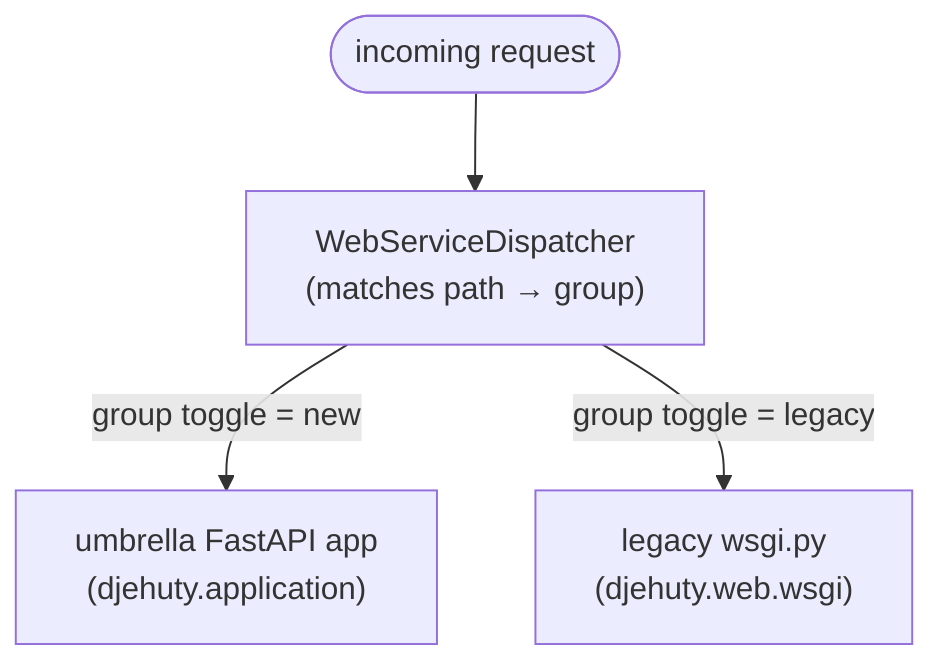

# HTTP stack migration: Werkzeug to FastAPI

## The goal

Replace the ~10k line `src/djehuty/web/wsgi.py` with a FastAPI stack.

We ship it one route group at a time. Every group can be switched between the new
implementation and the legacy one in
production, independently. So if `/api/v3` (new) misbehaves in your deployment, we do
not scramble on a hotfix and a redeploy. We flip that one group back to legacy,
restart, and we are back to known-good in seconds. Then we fix the new code calmly,
test it, deploy, and flip it on again.

## Principles

1. **AS-IS.** Users notice nothing. The new handlers reproduce the legacy behaviour
   faithfully, including quirks, so switching new/legacy is invisible to clients.
2. **Reversible per group.** Any group can be flipped new to legacy (or back) with a
   config change and a restart. No code change, no rebuild, no new image.
3. **Detached.** The new code lives in its own package tree (`djehuty.api`,
   `djehuty.auth`, `djehuty.views`, `djehuty.services`). The legacy `wsgi.py` stays
   untouched until we delete it. It is always clear what will be removed.
4. **Incremental in and out.** Groups arrive one PR at a time, and legacy is removed
   one group at a time. No step is large enough to be scary.

## What we do not touch: the database and business logic

This is the part that matters most for keeping the risk low, so it is worth
being explicit for anyone worried about the change.

The migration replaces the HTTP layer: the code that parses a request and builds a
response. It does not rewrite what the application actually does. Two categories:

**Shared, never copied, never modified.** The database interface
(`djehuty.web.database`, the SparqlInterface) and the neutral core (`validator`,
`formatter`, `config`, `s3`, `locks`, `email_handler`, `convenience`, `constants`)
stay exactly where they are. The new handlers receive the same `db` object the legacy
server uses and call the same methods (`db.datasets(...)`,
`db.account_by_session_token(...)`, and so on). Same code, same queries, same results.
There is no second copy to drift, so there is no way for these to behave differently
between new and legacy. This is where most of the business logic actually lives, and
we do not go near it.

**Copied AS-IS, legacy left intact.** Some logic used to live inside the `wsgi.py`
handler methods: the SAML attribute mapping, the account-creation side effects on
login, git repository resolution, and so on. To use it from the new stack without
importing `wsgi.py`, we copy it verbatim into `djehuty.services`, preserving behaviour
line for line. We do NOT edit the legacy copy. That is deliberate: legacy stays
self-contained and fully working, which is exactly what makes a toggle-back safe. So
during the migration this logic lives in two places on purpose. The copies are pinned
by the AS-IS test suite, and the duplication disappears when a group's legacy handlers
are removed (see "Removing legacy later").

What guarantees we did not change behaviour:

- An isolation test asserts no new-stack module imports `djehuty.web.wsgi`.
- The AS-IS contract tests pin the exact status codes and payloads, including known
  legacy quirks, so new and legacy respond identically.
- `wsgi.py` is not edited when a group is added. It is only touched when that group's
  legacy handlers are finally deleted.

## How it works

The new stack is one umbrella FastAPI app (`djehuty.application:create_app`) that
mounts every new router. In front of it sits a small WSGI dispatcher that decides,
per request, whether the new stack or the legacy `wsgi.py` handles it. Both entry
points serve the dispatcher — the internal development server and the uWSGI
`application` entry point (which builds it once and reuses it across requests) — so
deployments behave the same either way.



Three pieces:

- **Route-group registry.** One module maps each group to its path matchers, for
  example `api-v3` owns everything under `/v3/`, `admin` owns `/admin/`. This is the
  single source of truth for "which group does this path belong to".
- **Umbrella app.** Always mounts all the new routers. Mounting a router does not
  make it live; the dispatcher decides that.
- **Per-group dispatcher.** For each request: find the group for the path, read that
  group's toggle, send the request to the new app or to legacy.

## Configuration

The `web-service` section lives at the top level of the config file. `default` is the
global posture (`new` or `legacy`); `groups` pins individual groups. JSON, since the
XML config is deprecated:

```json
"web-service": {
  "default": "new",
  "groups": {
    "api-v2": "new",
    "admin": "legacy"
  }
}
```

Read this as: everything runs on the new stack, except `admin`, which runs on legacy.
The old flat `"web-service": "new"` / `"legacy"` value still works as a global default,
and `api-service` is accepted as a back-compat alias for the key.

**The config is optional.** With no `web-service` block, `default` is `new`, so every
group runs new. The config is there for visibility and control, not because the code
needs it.

**Every group lists itself.** Each group's PR adds its own line under `groups`, set to
`"new"` (foundation registers none; api-v2 adds `api-v2`, api-v3 adds `api-v3`, ...).
A group set to `"new"` is a no-op functionally (that is the default), but the config
becomes a dashboard: operators see every surface and its state, and rolling one back is
changing one word to `"legacy"`. A group missing from the config still falls back to
`default`, so a forgotten line never breaks anything.

**The docs are always on.** The `api-docs` group (`/api/docs`, `/api/redoc`,
`/api/openapi.json`) is `always_new`: it is served by the new stack regardless of the
toggle, so the API reference stays available even with `{"default": "legacy",
"groups": {}}`. It is not listed under `groups` because it is not toggleable. Legacy
has no `/api/` routes, so this is always safe.

Per environment matters. Production can pin a group to `legacy` while it is still being
validated, even though the default is `new`. Staging can run everything `new`.

**Flipping in production:** change the one value, restart the service. That is the whole
procedure. Restart is fast and needs no rebuild. Live reload without a restart is
possible later, but a restart is good enough and simpler to reason about.

## Route groups

Each group is one PR and one toggle. Approximate route counts from the legacy URL map:

| Group            | Owns (paths)                                                        | Routes | Legacy handlers |
|------------------|---------------------------------------------------------------------|-------:|-----------------|
| `api-v2`         | `/v2/`                                                               |   ~56  | `api_*` v2       |
| `api-v3`         | `/v3/`                                                               |   ~60  | `api_v3_*`       |
| `auth`           | `/login`, `/logout`, `/saml/`                                        |     4  | `ui_login`, `ui_logout`, `saml_metadata` |
| `public-ui`      | `/`, `/portal`, `/browse`, `/robots.txt`, `/sitemap.xml`, `/theme/`, `/categories/`, `/category`, `/institutions/`, `/authors/`, `/search`, `/opendap_to_doi`, `/feedback`, `/data_access_request` | ~15 | `ui_home`, `ui_categories`, ... |
| `datasets-ui`    | `/datasets/`, `/articles/`, `/private_datasets/`                     |    ~9  | `ui_dataset`, `ui_private_dataset` |
| `collections-ui` | `/collections/`, `/private_collections/`                            |    ~5  | `ui_collection`, `ui_private_collection` |
| `my`             | `/my/`                                                               |   ~25  | `ui_my_*`        |
| `admin`          | `/admin/`                                                            |   ~23  | `ui_admin_*`     |
| `review`         | `/review/`                                                           |     5  | `ui_review_*`    |
| `exports`        | `/export`, `/ndownloader`, `/file`                                  |    ~4  | export/download handlers |
| `iiif`           | `/iiif/`                                                             |     5  | `iiif_v3_*`      |
| `misc`           | `/account`, leftovers                                                |    ~2  | misc            |

The API and public-ui groups are largely done on `refact/fastapi`. The heavy remaining
work is `my` and `admin`.

## Branch and PR structure

Every migration branch is prefixed `feat/new-http-` so the work is recognizable at a
glance. Each branch is one PR into the `new-http` integration branch.

```
main
 +-- new-http                    integration branch, forked from main
      +-- feat/new-http-foundation      registry + per-group dispatcher + toggle config + umbrella skeleton + test harness (+ this doc)
      +-- feat/new-http-api-v2
      +-- feat/new-http-api-v3
      +-- feat/new-http-auth
      +-- feat/new-http-public-ui       also brings the templating foundation (djehuty.views)
      +-- feat/new-http-datasets-ui
      +-- feat/new-http-collections-ui
      +-- feat/new-http-my
      +-- feat/new-http-admin
      +-- feat/new-http-review
      +-- feat/new-http-exports
      +-- feat/new-http-iiif
      +-- feat/new-http-misc
```

Rules of the road:

- **`feat/new-http-foundation` lands first** and adds no user-facing behaviour. Every
  group defaults to a no-op until its PR registers it. Easy, low-anxiety review. It also
  carries this design doc.
- Each group PR = the new router(s) + register the group in the dispatcher + tests.
- Commits inside a PR are organized, not one blob. A typical shape:
  1. extract framework-neutral logic into `djehuty.services`
  2. add the FastAPI router
  3. register the group + wire the dispatcher
  4. tests (unit + e2e)
- The groups depend on each other (for example `api-v3` reuses shared code from
  `api-v2`), so the branches form a chain. Two equivalent ways to manage it:
  - **Merge-as-you-go:** merge each `feat/new-http-*` into `new-http` (a
    regular `--no-ff` merge, not squash, to keep the organized commits) as it is
    ready, then branch the next group off the updated `new-http`. One
    integration point, no deep rebases. This is the default.
  - **Stacked branches:** base each group branch on the previous one and keep them
    open as a stack (each PR's base is the branch below). Cleaner incremental diffs
    and nothing merges until the end, at the cost of restacking (use
    `git rebase --update-refs`) whenever a lower branch changes. Merge bottom-up.
- `new-http` stays mergeable to `main` at any time, because merged groups can
  default `new` or be pinned `legacy` per environment.

## Rollback runbook

The scenario this whole design exists for. Say `/api/v3` on the new stack shows a bug
in production:

1. Edit the production config: set `web-service.groups.api-v3 = "legacy"`.
2. Restart the service. `/v3/` is now served by legacy `wsgi.py` again. Users are back
   to known-good behaviour. No code change was needed.
3. Reproduce and fix the bug on a branch off `new-http`. Add a test that covers
   it. Get it reviewed and merged.
4. Deploy the new image.
5. Set `web-service.groups.api-v3` back to `"new"` (or remove the override), restart.

Time-to-mitigation is a config edit and a restart, not a code-fix-build-deploy cycle.

## Removing legacy later

Same safety story on the way out. Once a group has run happily on `new` in production
for long enough, a small follow-up PR:

- deletes that group's legacy handlers from `wsgi.py`,
- drops the group's toggle (it is always new now).

`wsgi.py` shrinks group by group. When the last group is removed, `wsgi.py` and the
`legacy` branch of the dispatcher are deleted together. No big-bang deletion.

## Reusing the existing work

We do not rewrite. The `refact/fastapi` spike already has the API, auth, templating
foundation and public pages ported, with 225 unit tests and the e2e smoke/auth/search
suites green. Those commits are the source material. Each group PR lifts the relevant
code from `refact/fastapi`, adds the per-group toggle, and organizes the commits. This
keeps the proven code and gives the team a reviewable, reversible package.

## Testing

- **Unit tests** per group, using FastAPI's `TestClient` with a fake db. Fast, run
  locally, no container.
- **e2e tests** (Playwright, in the container) per marker: `smoke`, `auth`, `search`,
  `admin`, and so on. Each group PR must keep its marker green.
- **Isolation guardrail:** an AST test asserts no new-stack module imports
  `djehuty.web.wsgi`. This keeps the dependency direction one-way so the final
  deletion stays fearless.
- **AS-IS check:** where the legacy behaviour is a known bug, the e2e suite records it
  as a warning rather than a failure, and the new handler reproduces it, so a
  new/legacy flip is invisible.

## Open questions and later work

- Live config reload so a flip needs no restart. Nice to have, not required for v1.
- Per-group request metrics, so we can watch a freshly-flipped group in production.
- Whether `datasets-ui` and `collections-ui` should be one group or two (they share a
  lot of metadata assembly).
